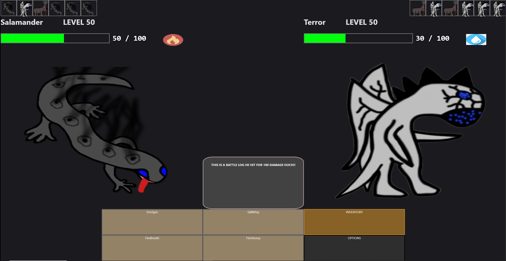

# 🐾 Creature Trainer Playground

**Creature Trainer Playground** is a learning project where I learn `vanilla JavaScript` (with a few helper packages), `PIXI.js` for rendering, and `Vite` for bundling. Im also teaching myself `node.js` which is used for the backend, and I am also going to use `socket.io` for realtime features such as battles. For the Database this project uses `postgreSQL`.

## The Idea

**Creature Trainer** is a game where you can tame, collect, breed, and evolve creatures, then use them in battles against other players. The Game loop and battle mechanics are going to be further developed in the future for now this is basically using pokemon and digimon as a reference until I understand the Tech and can really start diving into Game ideas and concepts.

`Current Battle UI`


## Tech Stack

- **Frontend:**
  - [Vanilla JavaScript (Typescript)](https://developer.mozilla.org/en-US/docs/Web/JavaScript)
  - [PIXI.js](https://pixijs.com/)
  - [Vite](https://vitejs.dev/) 
  - [RxJS](https://rxjs.dev/) 

- **Backend:**
  - [Node.js](https://nodejs.org/)
  - [Express](https://expressjs.com/) 
  - [Socket.IO](https://socket.io/) 
  - potentially
    - gun.js
    - prisma

## Folder Structure (Needs to be improved!)

```
/src (Frontend)
  /screens         
  /services        
  /creatures       
  main.ts          

/server (Backend)
  index.ts         
```

## 📦 Install Dependencies 

```bash
# Install dependencies (In both root of the project and within server folder)
npm install

# Start Frontend from root of the project
npm run dev

# Start the backend server
npm start
```

Make sure both frontend and backend are running in parallel. 


